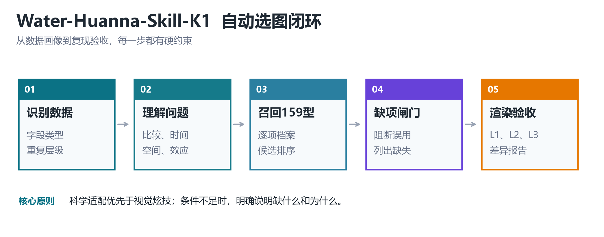
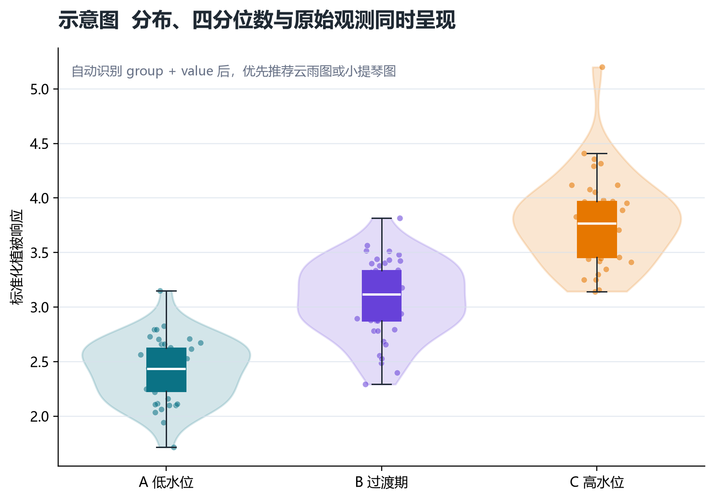
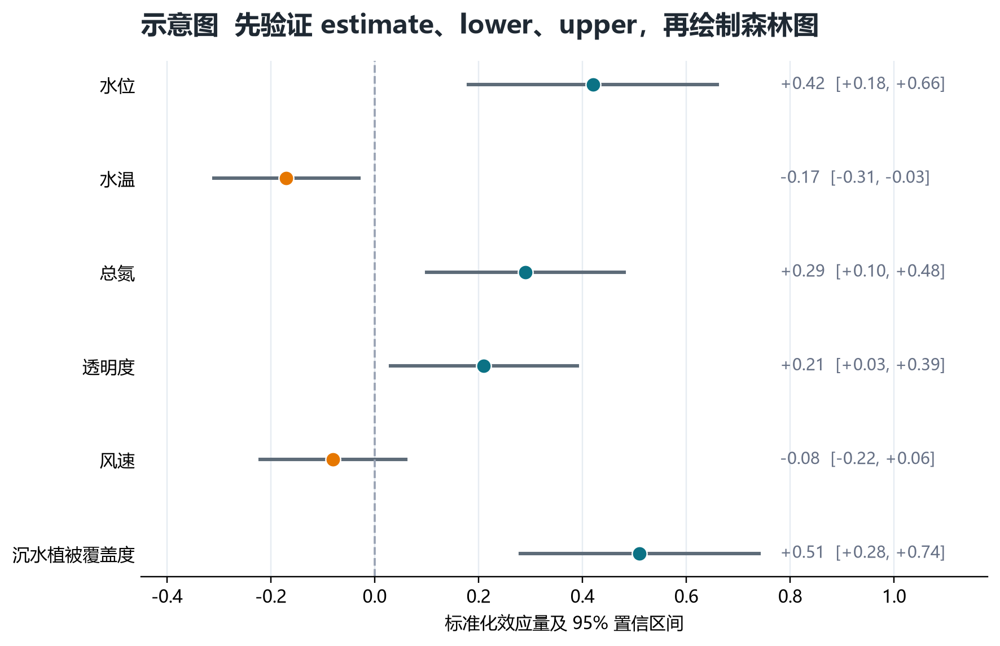

# Water-Huanna-Skill-K1

面向科研数据的自动选图、规范绘图与分级复现 Skill。



## 核心优势

### 1. 159 个案例逐一建档

内置 159 个独立 Style ID。每项记录适用问题、必填字段、统计前提、坐标系统、布局、渲染引擎、复现风险和验收等级。对原指南中错置的患者泳道图、森林图及空间转录组分类进行了审读校正。

### 2. 自动识别数据应当画什么

读取 CSV、TSV、JSON、GeoJSON 或 XLSX 后，识别连续变量、分类变量、时间、空间坐标、效应量、置信区间、网络边和组学字段。推荐过程依次经过数据画像、研究问题识别、候选召回、硬约束过滤和多目标评分。

### 3. 科学适配优先

图形选择服从研究设计。配对图检查个体 ID，重复测量检查时间与受试者，森林图检查效应量及区间，网络图检查边表，地图检查坐标系和边界来源。视觉表现不能替代统计前提。

### 4. 缺什么，逐项说明

数据不足时停止绘制，返回结构化缺项报告。报告列明缺少字段、必要性、当前影响和可接受的补充示例，减少依靠猜测生成错误图形的风险。

### 5. 分级复现，拒绝虚假承诺

- L1 科学等价：数据处理、统计结果与图形语义一致。
- L2 视觉高保真：图层、布局、配色、字体、标签与导出规格高度一致。
- L3 像素级：还需原始代码、数据、包版本、字体、随机种子与输出设备。

当前材料无法支撑更高等级时，明确给出限制原因。



## 典型使用

```bash
python scripts/water_huanna.py inspect data.csv
python scripts/water_huanna.py recommend data.csv --goal "比较三组植被指标的分布与离群值" --top 5
python scripts/water_huanna.py validate data.csv --style-id 7 --target-fidelity l1
python scripts/water_huanna.py render data.csv --style-id 7 --output figure.png
```

字段名不规范时显式映射：

```bash
python scripts/water_huanna.py validate result.csv \
  --style-id 79 \
  --map term=变量 \
  --map estimate=效应量 \
  --map lower=CI下限 \
  --map upper=CI上限
```



## 输出内容

- 风格推荐及评分
- 数据字段映射和完整性报告
- 缺项与阻断理由
- PNG 预览图
- 可扩展的 SVG、PDF 和 600 dpi TIFF 输出
- R 或 Python 代码及运行环境信息
- 复现等级和差异说明
- 统计方法与图注建议

## 地图合规

地图类 Style ID 89—93 进入独立合规闸门。必须记录边界来源、坐标参考系、投影、底图与审核条件。中国地图需完整准确表示国界、中国台湾、南海诸岛等要素。在线底图默认采用腾讯地图，可选高德、百度或天地图。

## 当前能力边界

基础引擎可以直接渲染常见散点、气泡、火山、森林、柱形、折线、箱线、小提琴、热图、相关矩阵和雷达图。系统发育树、复杂网络、桑基、和弦、空间转录组、多轨环图等图型依赖专用结构文件或布局参数，验证条件满足后再调用对应 R 或 Python 实现。基础引擎会阻断近似替代。

## 来源与版权

159 个 Style ID 源于用户提供的科研图表指南，经结构审读和图文核对后形成数据契约。仓库仅保留原创介绍图，不分发来源文档中的 159 张参考图。原案例图版权归相应作者、论文出版方及来源网站所有。
